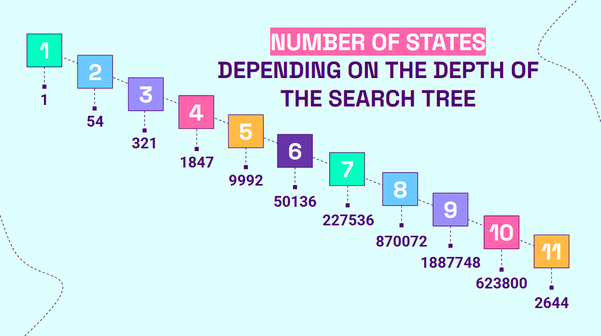
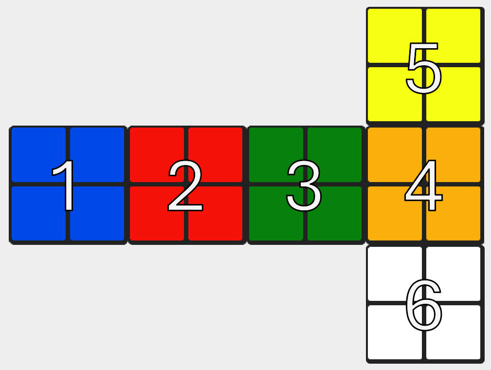
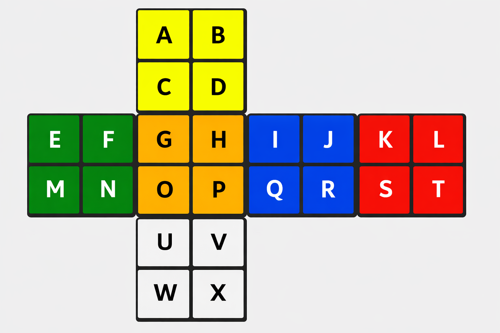
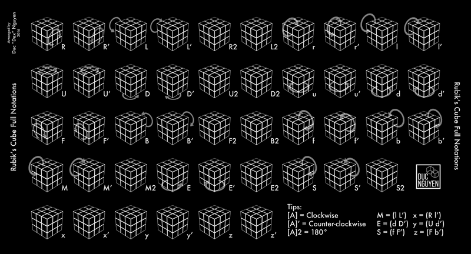
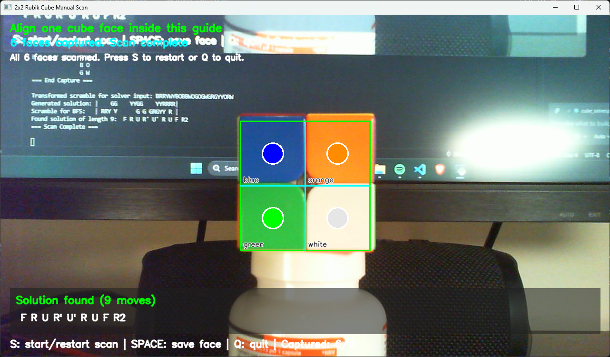

# 2x2 Rubik's Cube Scanner + Solver

This project uses a webcam to scan a 2x2 cube face-by-face, recognize sticker colors, and compute an optimal solution.

## Table of Contents

- [Problem Overview](#problem-overview)
- [How Scanning Works](#how-scanning-works)
   - [Face Layout Scan Order](#face-layout-scan-order)
- [How Color Recognition Works](#how-color-recognition-works)
   - [Why HSV Instead of RGB/BGR?](#why-hsv-instead-of-rgbbgr)
- [How the Solution Is Found](#how-the-solution-is-found)
   - [1) Input Validation](#1-input-validation)
   - [2) Transform Scan to Solver Input](#2-transform-scan-to-solver-input)
   - [3) State Reduction Used by This Solver](#3-state-reduction-used-by-this-solver)
   - [4) Bidirectional BFS](#4-bidirectional-bfs)
- [Move Notation](#move-notation)
- [Running](#running)
    - [Example](#example)
- [Project Files](#project-files)

## Problem Overview

A 2x2 Rubik's Cube has:

- **3,674,160 legal states**
- A proven maximum optimal solution length of **11 moves** (God's number in quarter-turn metric)

That means every valid 2x2 scramble can be solved in at most 11 moves.

For reference, this image shows how the number of unique states grows with search depth:



## How Scanning Works

The scanner (`cube_solver.py` + `helper_functions.py`) uses a **fixed 2x2 guide** in the camera frame:

1. Press `s` to start/restart scanning.
2. Align one cube face inside the on-screen 2x2 guide.
3. Press `SPACE` to capture the current face.
4. Rotate and repeat until all 6 faces are captured in this order:
   - Faces `1 -> 2 -> 3 -> 4` (horizontal belt)
   - Face `5` (top)
   - Face `6` (bottom)

For each of the 4 cells in the guide, the scanner samples the center region, computes average BGR values, and assigns a color label.

### Face Layout Scan Order

The captured order is interpreted as:



## How Color Recognition Works

Each cell is classified from its sampled BGR color:

1. Convert BGR to HSV.
2. Apply fixed threshold rules to classify one of:
   - `white`, `yellow`, `red`, `orange`, `green`, `blue`
   - `unknown` (if no rule matches)

Threshold logic is in `helper_functions.py`, function `classify_bgr_color()`.

### Why HSV Instead of RGB/BGR?

HSV is easier to threshold for cube colors because channels are more semantically meaningful:

- **Hue (H):** color family (red/yellow/green/blue)
- **Saturation (S):** vivid color vs gray/white
- **Value (V):** brightness

This makes rules such as *white = low saturation + high brightness* straightforward and generally more robust to lighting variation than thresholding directly in BGR.

## How the Solution Is Found

Core solver logic is implemented in `solving_logic.py`.

### 1) Input Validation

Before solving, `scanned_faces_correct()` verifies:

- No `unknown` stickers
- Exactly 6 colors are present
- Each color appears exactly 4 times

### 2) Transform Scan to Solver Input

Captured faces are converted to the solver's internal representation using `transform_scan_format_to_solver_input()`.

The solver represents cube state as a color string (see notation image):



The notation template is:

`scramble = "ABCDEFGHIJKLMNOPQRSTUVWX"`

Example state string (for the illustrated cube):

`scramble = "YYYYGGOOBBRRGGOOBBRRWWWW"`

### 3) State Reduction Used by This Solver

This solver intentionally reduces the state (`discard_unnecessary_faces()` and `generate_solution()`) to keep only colors needed under the chosen move set.

Why this is valid here:

- The search uses only `R`, `U`, `F` turns.
- With this formulation, one reference corner (back-left-bottom) stays fixed in position.
- The three colors on that corner are enough to anchor the reduced-state representation used by the algorithm.

This significantly reduces search complexity while preserving the information required by this solver design.

### 4) Bidirectional BFS

`bi_directional_BFS()` searches from both directions:

- Forward from the scanned scramble state
- Backward from the generated target state

Since optimal 2x2 solutions are bounded by 11 moves, searching from both ends lets the algorithm meet near the middle. The code uses:

- `SOLUTION_MIDPOINT = 6`

So each frontier expands up to depth 6, and the solution is formed when both frontiers meet.

## Move Notation

The output uses standard cube notation:

- `R` = Right face clockwise (90°)
- `R'` = Right face counterclockwise (90°)
- `R2` = Right face 180°
- Same pattern applies to `U` (Up) and `F` (Front)

Example:

- `R U' F` means:
  1. Turn Right clockwise
  2. Turn Up counterclockwise
  3. Turn Front clockwise

Rotation reference on 3x3 cube:



## Running

From project root:

```bash
python cube_solver.py
```

If camera index `1` does not work on your machine, change `cv2.VideoCapture(1)` in `cube_solver.py`.


### Example

Watch an example scan and solve in action:

[](https://youtu.be/CH0ohltKveI)

## Project Files

- `cube_solver.py` — camera loop, scan flow, solve trigger, on-frame solution overlay
- `helper_functions.py` — guide drawing, sampling, color classification, UI text, overlays
- `solving_logic.py` — validation, scan transform, reduced-state model, bidirectional BFS solver
